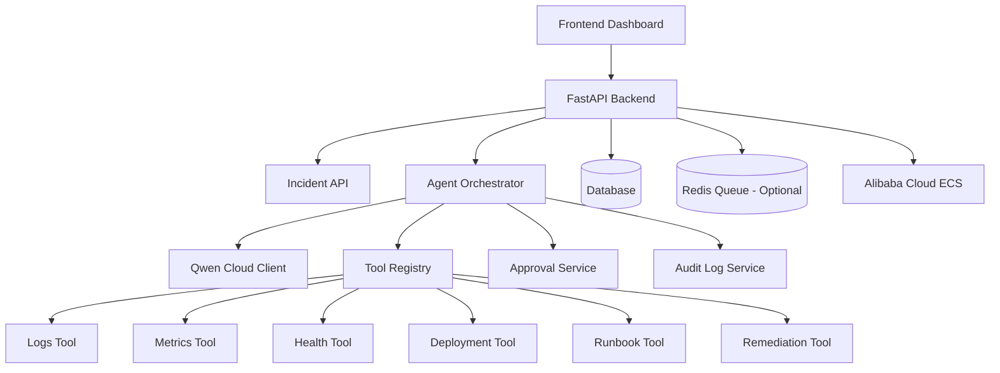

# OpsPilot Agent — LLM Implementation Guide

## Purpose

This document is the step-by-step implementation guide for building **OpsPilot**, a Qwen-powered Autopilot Agent for incident triage and safe remediation.

The coding LLM working on this repository must:

1. Save this file as `docs/00-implementation-guide.md`.
2. Follow this guide in order.
3. Update checklist items as work is completed.
4. Keep the project aligned with **Track 4: Autopilot Agent**.
5. Build a production-style backend workflow, not a generic chatbot.

---

## Project Summary

**Project name:** OpsPilot  
**Track:** Track 4 — Autopilot Agent  
**Core idea:** An AI incident-response agent for backend/SRE workflows.

OpsPilot receives a system alert, investigates logs, metrics, service health, deployment history, and runbooks, uses Qwen Cloud for structured reasoning, recommends remediation, asks for human approval for risky actions, safely executes or simulates remediation, records an audit trail, and generates a final incident report.

---

## Non-Negotiable Rules

### Agent Safety

- The model must not directly execute infrastructure actions.
- The model proposes actions; backend policy decides whether actions are allowed.
- Dangerous actions require human approval.
- Unknown tools must be rejected.
- The agent loop must have a hard `max_steps` limit.
- All model outputs must be parsed and validated with Pydantic schemas.
- All tool calls, decisions, approvals, and remediation events must be persisted.

### Backend Design

- Routes stay thin.
- Business logic lives in services.
- Agent orchestration lives in the agent layer.
- Tool execution goes through a registry.
- Qwen calls go through one provider/client wrapper.
- No API keys or secrets should be committed.
- Use `.env.example` for required variables.
- Tests must use a mock LLM provider by default.

### Hackathon Compliance

The final project must include:

- Qwen model usage through Qwen Cloud.
- Public open-source repository with a visible license.
- Architecture diagram showing Qwen Cloud, backend, database, frontend, and tools.
- Alibaba Cloud backend deployment proof.
- Demo video under 3 minutes.
- Devpost text description.
- Track identification: `Track 4: Autopilot Agent`.

---

## Recommended Stack

### Backend

- Python 3.11+
- FastAPI
- Pydantic
- SQLAlchemy
- Alembic
- SQLite for fast MVP; PostgreSQL later if time allows
- Redis optional for queue/worker stretch
- Pytest
- Ruff or Black
- Docker + Docker Compose

### Frontend

Start simple:

- React + Vite + TypeScript

Alternative for fastest demo:

- Minimal FastAPI/Jinja dashboard

The backend matters more than frontend polish.

### LLM Provider

Development mode:

```env
LLM_PROVIDER=mock
```

Final demo/submission mode:

```env
LLM_PROVIDER=qwen
QWEN_API_KEY=...
QWEN_MODEL=qwen3.7-plus
QWEN_BASE_URL=...
```

Optional advanced model later:

```env
QWEN_REASONING_MODEL=qwen3.7-max
```

---

## Repository Structure

Create this structure:

```txt
opspilot-agent/
  backend/
    app/
      main.py
      core/
        config.py
        logging.py
        security.py
      api/
        routes_health.py
        routes_incidents.py
        routes_approvals.py
        routes_demo.py
      agents/
        incident_agent.py
        prompts.py
        schemas.py
        parser.py
        policies.py
      llm/
        base.py
        mock_provider.py
        qwen_provider.py
      services/
        incidents.py
        approvals.py
        audit.py
        memory.py
        qwen_client.py
      tools/
        base.py
        registry.py
        logs_tool.py
        metrics_tool.py
        health_tool.py
        deployment_tool.py
        runbook_tool.py
        remediation_tool.py
        notification_tool.py
      models/
        incident.py
        agent_step.py
        approval.py
        audit_log.py
        memory.py
      db/
        session.py
        base.py
      tests/
        test_health.py
        test_incidents.py
        test_agent_loop.py
        test_tools.py
        test_approvals.py
        test_qwen_client.py
  frontend/
  docs/
    00-implementation-guide.md
    01-problem.md
    02-architecture.md
    03-agent-design.md
    04-tool-system.md
    05-human-in-the-loop.md
    06-testing.md
    07-deployment.md
    08-demo-script.md
    09-qwen-cloud-usage.md
  deployment/
    alibaba-cloud.md
    docker-compose.prod.yml
    nginx.conf
  docker-compose.yml
  .env.example
  .gitignore
  README.md
  LICENSE
```

---

# Phase 1 — Documentation First

## Task 1.1 — Create `docs/01-problem.md`

Explain:

- Small teams receive alerts but still manually check logs, metrics, deployments, and runbooks.
- Manual triage wastes time during incidents.
- Fully autonomous remediation is risky.
- OpsPilot automates first response while keeping humans in control.

Acceptance criteria:

- [x] Problem statement exists.
- [x] Target users are listed.
- [x] Non-goals are listed.
- [x] One-line pitch is clear.

Suggested content:

```md
# Problem

Small engineering teams often run APIs, workers, queues, databases, and scheduled jobs without a dedicated SRE team. When an alert fires, the developer must manually check logs, metrics, service health, recent deployments, and runbooks before deciding what to do.

OpsPilot reduces response time by using an AI agent to investigate the incident, call approved tools, summarize evidence, recommend a fix, request human approval for risky actions, and generate a final report.
```

---

## Task 1.2 — Create `docs/02-architecture.md`

Include:

- System overview.
- Architecture diagram in Mermaid.
- Explanation of backend ownership of state and safety.
- Qwen Cloud role.
- Tool registry.
- Approval system.
- Audit log.
- Alibaba Cloud deployment target.

Mermaid starter:



Acceptance criteria:

- [x] Qwen Cloud appears in the diagram.
- [x] Backend, DB, UI, tools, approval, audit, and Alibaba Cloud appear.
- [x] It is clear that the model does not execute infrastructure directly.

---

## Task 1.3 — Create `docs/03-agent-design.md`

Document the controlled agent loop:

1. Load incident.
2. Ask Qwen to classify severity and propose tools.
3. Validate tool names against allowlist.
4. Run selected tools.
5. Send tool outputs back to Qwen.
6. Ask for diagnosis and remediation recommendation.
7. Apply backend risk policy.
8. Execute safe action or create approval request.
9. Generate final report.
10. Persist all steps.

Acceptance criteria:

- [x] Agent loop documented.
- [x] `max_steps` documented.
- [x] JSON schema requirement documented.
- [x] Tool allowlist documented.
- [x] Approval rule documented.

---

## Task 1.4 — Create `docs/04-tool-system.md`

Document each tool:

| Tool | Purpose |
|---|---|
| logs_tool | Read seeded logs and return relevant errors |
| metrics_tool | Return seeded metrics like error rate, latency, DB connections, queue depth |
| health_tool | Return service health states |
| deployment_tool | Return recent deployments and changed files |
| runbook_tool | Retrieve markdown runbook guidance |
| remediation_tool | Execute or simulate approved actions |
| notification_tool | Simulate Slack/email/status update |

Tool interface:

```txt
name: string
description: string
input_schema: Pydantic model
risk_level: safe | medium | dangerous
run(input) -> ToolResult
```

ToolResult:

```json
{
  "status": "success",
  "data": {},
  "summary": "",
  "error": null
}
```

Acceptance criteria:

- [x] Tool interface documented.
- [x] Inputs and outputs documented.
- [x] Risk levels documented.
- [x] Unknown tool behavior documented.

---

## Task 1.5 — Create `docs/05-human-in-the-loop.md`

Explain:

- Risk levels: `safe`, `medium`, `dangerous`.
- Safe actions can execute immediately.
- Dangerous actions require approval.
- Rejected actions must not execute.
- Approval requests must include reason, expected impact, risk, and rollback plan.

Acceptance criteria:

- [x] Risk levels explained.
- [x] Approval flow explained.
- [x] Rejection behavior explained.
- [x] Audit requirements explained.

---

## Task 1.6 — Create `docs/06-testing.md`

Include test categories:

- Unit tests.
- Integration tests.
- Agent evaluation tests.
- Failure tests.
- Safety/security tests.

Evaluation scenarios:

1. High API error rate.
2. Queue backlog.
3. Database latency spike.
4. Ambiguous alert.
5. Tool failure.

Acceptance criteria:

- [x] Test matrix exists.
- [x] Each demo scenario has expected behavior.
- [x] Mock LLM strategy is documented.

---

## Task 1.7 — Create `docs/07-deployment.md`

Include:

- Alibaba Cloud ECS deployment plan.
- Docker Compose production stack.
- Environment variables.
- Health endpoint.
- Proof files.
- Testing instructions.

Acceptance criteria:

- [x] Alibaba Cloud target documented.
- [x] `/health` endpoint mentioned.
- [x] Deployment proof plan included.

---

## Task 1.8 — Create `docs/08-demo-script.md`

Use this 3-minute structure:

| Time | Scene |
|---|---|
| 0:00–0:20 | Problem |
| 0:20–0:45 | Create alert |
| 0:45–1:25 | Agent triage |
| 1:25–1:55 | Diagnosis |
| 1:55–2:20 | Approval |
| 2:20–2:40 | Remediation |
| 2:40–3:00 | Architecture |

Acceptance criteria:

- [x] Script is under 3 minutes.
- [x] Shows Qwen-powered agent workflow.
- [x] Shows human approval.
- [x] Shows Alibaba Cloud + Qwen Cloud architecture.

---

## Task 1.9 — Create `docs/09-qwen-cloud-usage.md`

Explain:

- Which Qwen model is used.
- Where the code calls Qwen.
- Why Qwen is used.
- How to configure environment variables.
- How to switch between mock and Qwen provider.
- How this satisfies hackathon requirements.

Acceptance criteria:

- [x] Model name documented.
- [x] Qwen integration file path listed.
- [x] Env vars listed.
- [x] Mock vs Qwen provider explained.

---

# Phase 2 — Project Setup

## Task 2.1 — Initialize repo

Create:

- `README.md`
- `LICENSE`
- `.gitignore`
- `.env.example`
- `docker-compose.yml`
- `backend/`
- `docs/`
- `deployment/`

Acceptance criteria:

- [x] Repo has MIT license or another valid open-source license.
- [x] README has project summary.
- [x] `.env.example` contains all required variables.
- [x] `.gitignore` excludes `.env`, virtualenv, cache files, build output.

---

## Task 2.2 — Backend skeleton

Create FastAPI app:

- `backend/app/main.py`
- `backend/app/core/config.py`
- `backend/app/api/routes_health.py`

Endpoint:

```http
GET /health
```

Expected response:

```json
{
  "status": "ok",
  "service": "opspilot",
  "llm_provider": "mock"
}
```

Acceptance criteria:

- [x] App starts locally.
- [x] `/health` returns 200.
- [x] Config loads from environment.
- [x] Tests pass for health endpoint.

---

## Task 2.3 — Docker setup

Create Docker setup for backend.

Acceptance criteria:

- [x] `docker compose up --build` starts backend.
- [x] Backend available at `http://localhost:8000`.
- [x] `/health` works inside Docker.

---

# Phase 3 — Data Model and Core API

## Task 3.1 — Define enums and schemas

Create schemas for:

- Severity: `low`, `medium`, `high`, `critical`.
- Incident status: `new`, `triaging`, `waiting_for_approval`, `remediating`, `resolved`, `failed`.
- Risk level: `safe`, `medium`, `dangerous`.
- Tool status: `success`, `failed`.

Acceptance criteria:

- [x] Invalid enum values are rejected.
- [x] Pydantic schemas have examples.

---

## Task 3.2 — Incident model/service

Implement Incident fields:

- `id`
- `title`
- `description`
- `source`
- `severity`
- `status`
- `root_cause_summary`
- `recommended_action`
- `final_report`
- `created_at`
- `updated_at`

Acceptance criteria:

- [x] Create incident.
- [x] List incidents.
- [x] Get incident detail.
- [x] Update incident status.
- [x] Tests cover valid and invalid creation.

---

## Task 3.3 — AgentStep model/service

Fields:

- `id`
- `incident_id`
- `step_number`
- `type`
- `tool_name`
- `input_json`
- `output_json`
- `model_summary`
- `status`
- `created_at`

Acceptance criteria:

- [x] Steps are ordered by `step_number`.
- [x] Tool input/output stored safely.
- [x] Sensitive values are not logged.

---

## Task 3.4 — ApprovalRequest model/service

Fields:

- `id`
- `incident_id`
- `action_name`
- `risk_level`
- `status`
- `reason`
- `expected_impact`
- `rollback_plan`
- `requested_at`
- `approved_by`
- `approved_at`

Acceptance criteria:

- [x] Create approval request.
- [x] Approve request.
- [x] Reject request.
- [x] Rejected request does not execute action.

---

## Task 3.5 — AuditLog model/service

Fields:

- `id`
- `actor`
- `action`
- `target_type`
- `target_id`
- `metadata_json`
- `created_at`

Acceptance criteria:

- [x] Incident creation is audited.
- [x] Tool calls are audited.
- [x] Approval decisions are audited.
- [x] Remediation actions are audited.

---

# Phase 4 — LLM Provider and Qwen Integration

## Task 4.1 — Create provider interface

File:

```txt
backend/app/llm/base.py
```

Interface:

```python
class LLMProvider(Protocol):
    async def generate_json(self, *, system: str, user: str, schema_name: str) -> dict:
        ...
```

Acceptance criteria:

- [x] Agent depends on provider interface, not a concrete provider.
- [x] Tests can use mock provider.

---

## Task 4.2 — Mock provider

File:

```txt
backend/app/llm/mock_provider.py
```

The mock provider should return deterministic JSON for demo scenarios.

Acceptance criteria:

- [x] High API error rate returns logs/metrics/health/deployment/runbook tools.
- [x] Queue backlog returns metrics/health/runbook tools.
- [x] Ambiguous alert returns safe broad investigation tools.
- [x] Tests use mock provider by default.

---

## Task 4.3 — Qwen provider and client

Files:

```txt
backend/app/llm/qwen_provider.py
backend/app/services/qwen_client.py
```

Requirements:

- Read `QWEN_API_KEY`, `QWEN_MODEL`, and `QWEN_BASE_URL`.
- Use timeouts.
- Use retries.
- Parse JSON only.
- Handle invalid JSON.
- Never log API keys.
- Return structured errors.

Acceptance criteria:

- [x] One simple local test can call Qwen.
- [x] Mocked test validates timeout handling.
- [x] Bad JSON from model does not crash agent.
- [x] README explains setup.

---

## Task 4.4 — Prompt contracts

File:

```txt
backend/app/agents/prompts.py
```

Create prompts for:

1. Triage.
2. Diagnosis.
3. Remediation recommendation.
4. Final report.

All prompts must ask for strict JSON.

Example triage output:

```json
{
  "severity": "high",
  "incident_type": "high_api_error_rate",
  "recommended_tools": ["logs_tool", "metrics_tool", "health_tool", "deployment_tool", "runbook_tool"],
  "reasoning_summary": "The alert indicates elevated API errors and requires logs, metrics, health, deployment, and runbook evidence.",
  "requires_human_approval": false
}
```

Acceptance criteria:

- [x] Schemas validate outputs.
- [x] Missing fields handled.
- [x] Unknown tools rejected.

---

# Phase 5 — Tool System

## Task 5.1 — Tool base interface

File:

```txt
backend/app/tools/base.py
```

Each tool must define:

- `name`
- `description`
- `risk_level`
- `input_schema`
- `run()`

ToolResult:

```json
{
  "status": "success",
  "data": {},
  "summary": "",
  "error": null
}
```

Acceptance criteria:

- [x] All tools share same interface.
- [x] Tool errors return structured failures.
- [x] Tool outputs are serializable.

---

## Task 5.2 — Tool registry

File:

```txt
backend/app/tools/registry.py
```

Requirements:

- Register all allowed tools.
- Reject unknown tools.
- Expose `get_tool(name)`.
- Expose `list_tools()`.

Acceptance criteria:

- [x] Unknown tool raises safe error.
- [x] Known tool executes.
- [x] Tests cover registry.

---

## Task 5.3 — Investigation tools

Implement:

- `logs_tool`
- `metrics_tool`
- `health_tool`
- `deployment_tool`
- `runbook_tool`

Use seeded demo data.

Acceptance criteria:

- [x] High API error scenario returns DB connection exhaustion evidence.
- [x] Queue backlog scenario returns worker/queue evidence.
- [x] Database latency scenario returns DB latency evidence.
- [x] Tool failure scenario can be simulated.

---

## Task 5.4 — Action tools

Implement:

- `remediation_tool`
- `notification_tool`

Actions:

- `generate_report` — safe.
- `send_status_update` — safe.
- `create_issue` — safe.
- `restart_api_workers_simulation` — dangerous.
- `rollback_deployment_simulation` — dangerous.
- `scale_workers_simulation` — medium/dangerous depending config.

Acceptance criteria:

- [x] Safe action can execute immediately.
- [x] Dangerous action requires approval.
- [x] Every action creates audit log.
- [x] Simulation result is visible in timeline.

---

# Phase 6 — Risk Policy and Approval

## Task 6.1 — Risk policy

File:

```txt
backend/app/agents/policies.py
```

Rules:

- `safe`: execute immediately.
- `medium`: require approval for MVP unless config says otherwise.
- `dangerous`: always require approval.
- Unknown actions: reject.

Acceptance criteria:

- [x] Model cannot override policy.
- [x] Dangerous action always creates approval request.
- [x] Tests cover policy.

---

## Task 6.2 — Approval endpoints

Endpoints:

```http
GET /api/approvals
GET /api/approvals/{id}
POST /api/approvals/{id}/approve
POST /api/approvals/{id}/reject
```

Acceptance criteria:

- [x] User can approve.
- [x] User can reject.
- [x] Approval executes pending action.
- [x] Rejection does not execute action.
- [x] Audit logs created.

---

# Phase 7 — Agent Orchestration

## Task 7.1 — Incident agent loop

File:

```txt
backend/app/agents/incident_agent.py
```

Implement controlled flow:

1. Set incident status to `triaging`.
2. Ask provider for triage JSON.
3. Validate recommended tools.
4. Run tools.
5. Store tool outputs as AgentStep.
6. Ask provider for diagnosis JSON.
7. Ask provider for remediation JSON.
8. Apply risk policy.
9. Execute safe action or create approval.
10. Generate final report if resolved.
11. Store audit logs.

Acceptance criteria:

- [x] Happy path works.
- [x] Tool failure does not crash whole agent.
- [x] Unknown tool rejected.
- [x] Max step limit enforced.
- [x] Incident status transitions correctly.

---

## Task 7.2 — Agent endpoints

Endpoints:

```http
POST /api/incidents/{id}/run-agent
GET /api/incidents/{id}/timeline
```

Acceptance criteria:

- [x] Run agent for incident.
- [x] Get visible timeline.
- [x] Timeline includes model decisions and tool calls.
- [x] Timeline includes approval request when needed.

---

## Task 7.3 — Demo scenarios

Endpoint:

```http
POST /api/demo/incidents/{scenario_name}
```

Scenarios:

- `high_api_error_rate`
- `queue_backlog`
- `database_latency`
- `ambiguous_alert`
- `tool_failure`

Acceptance criteria:

- [x] Each scenario creates a realistic incident.
- [x] High API error scenario is the main demo.
- [x] Scenario output is deterministic enough for video recording.

---

# Phase 8 — Dashboard

## Task 8.1 — Simple dashboard

Build pages:

- `/`
- `/incidents`
- `/incidents/:id`
- `/approvals`
- `/demo`

Must show:

- Incident list.
- Create demo incident button.
- Run agent button.
- Agent timeline.
- Tools called.
- Diagnosis.
- Recommended action.
- Approval buttons.
- Final report.

Acceptance criteria:

- [x] Demo can be run without Postman.
- [x] Judges can understand workflow visually.
- [x] UI does not hide backend evidence.

---

# Phase 9 — Tests and Evaluation

## Task 9.1 — Unit tests

Test:

- Schemas.
- Services.
- Tool registry.
- Risk policy.
- Approval transitions.
- Audit logging.

Acceptance criteria:

- [x] Tests pass locally.
- [x] Tests do not call live Qwen by default.

---

## Task 9.2 — Integration test

Test:

```txt
create incident -> run agent -> tool calls -> approval request -> approve -> remediation -> report
```

Acceptance criteria:

- [x] Full workflow passes with mock provider.
- [x] Final incident status is correct.
- [x] Timeline has expected steps.

---

## Task 9.3 — Agent evaluation cases

Create:

```txt
backend/app/tests/evals/
```

For each scenario define:

- input alert.
- expected severity.
- expected tools.
- expected approval behavior.
- expected diagnosis keywords.

Acceptance criteria:

- [x] Evaluation cases are runnable.
- [x] Results documented in `docs/06-testing.md`.

---

# Phase 10 — Deployment

## Task 10.1 — Production Docker

Create:

- `deployment/docker-compose.prod.yml`
- `deployment/nginx.conf`

Acceptance criteria:

- [x] Backend can run in production mode.
- [x] Env vars loaded from `.env`.
- [x] Health endpoint works.

---

## Task 10.2 — Alibaba Cloud deployment proof

Create:

```txt
deployment/alibaba-cloud.md
```

Include:

- ECS instance details without secrets.
- How app was deployed.
- Live health URL.
- Screenshot/recording link if available.
- Link to Qwen integration file.
- Link to architecture diagram.

Acceptance criteria:

- [ ] Backend runs on Alibaba Cloud.
- [ ] `/health` is reachable.
- [x] Proof file exists in repo.

---

# Phase 11 — Final README

README must include:

- Project name.
- One-line pitch.
- Track.
- Demo link.
- Video link.
- Architecture diagram.
- Features.
- Tech stack.
- How Qwen Cloud is used.
- How to run locally.
- How to run tests.
- Env vars.
- Deployment proof.
- Folder structure.
- Safety design.
- License.

Acceptance criteria:

- [ ] A judge can run the app from README.
- [ ] Qwen usage is obvious.
- [ ] Alibaba Cloud proof is obvious.
- [ ] Demo path is obvious.

---

# Phase 12 — Devpost Submission Pack

Create:

```txt
docs/10-devpost-submission.md
```

Include:

## Project description

OpsPilot is a Qwen-powered Autopilot Agent that helps small engineering teams respond to production incidents. It receives alerts, investigates logs, metrics, health checks, deployment history, and runbooks through backend tools, then recommends safe remediation steps. Risky actions require human approval before execution, and every decision is stored in an auditable timeline.

## Features

- Alert ingestion.
- Qwen-powered incident triage.
- Tool-based investigation.
- Human approval for risky actions.
- Simulated remediation.
- Final incident report.
- Audit timeline.
- Demo scenarios.
- Alibaba Cloud deployment.

## Track

Track 4: Autopilot Agent

## Production-oriented details

- Backend-owned safety policy.
- Tool allowlist.
- Structured model outputs.
- Approval gates.
- Audit logs.
- Error handling.
- Tests.
- Deployment docs.

Acceptance criteria:

- [ ] Devpost text is ready.
- [ ] Submission checklist is complete.

---

## Implementation Checklist

### Docs

- [x] `docs/00-implementation-guide.md`
- [x] `docs/01-problem.md`
- [x] `docs/02-architecture.md`
- [x] `docs/03-agent-design.md`
- [x] `docs/04-tool-system.md`
- [x] `docs/05-human-in-the-loop.md`
- [x] `docs/06-testing.md`
- [x] `docs/07-deployment.md`
- [x] `docs/08-demo-script.md`
- [x] `docs/09-qwen-cloud-usage.md`
- [ ] `docs/10-devpost-submission.md`

### Backend Foundation

- [x] FastAPI app
- [x] Config
- [ ] Logging
- [x] Health endpoint
- [x] Docker Compose
- [x] Tests

### Core Models

- [x] Incident
- [x] AgentStep
- [x] ApprovalRequest
- [x] AuditLog
- [ ] IncidentMemory optional

### LLM

- [x] Provider interface
- [x] Mock provider
- [x] Qwen provider
- [x] Qwen client
- [x] Prompt contracts
- [x] JSON validation

### Tools

- [x] Tool base
- [x] Tool registry
- [x] Logs tool
- [x] Metrics tool
- [x] Health tool
- [x] Deployment tool
- [x] Runbook tool
- [x] Remediation tool
- [x] Notification tool

### Agent

- [x] Controlled agent loop
- [x] Max step limit
- [x] Tool allowlist
- [x] Risk policy
- [x] Approval integration
- [x] Timeline persistence
- [x] Final report

### UI

- [x] Incident list
- [x] Incident detail
- [x] Timeline
- [x] Demo scenario launcher
- [x] Approval buttons
- [x] Final report display

### Submission

- [ ] Public repo
- [x] License
- [x] Architecture diagram
- [ ] Alibaba Cloud deployment
- [ ] Demo video
- [ ] Devpost text
- [ ] Optional blog/social post

---

## Final Build Order

Follow this exact order:

1. Save this guide as `docs/00-implementation-guide.md`.
2. Create all documentation skeletons.
3. Initialize repo and backend.
4. Build health endpoint.
5. Build data models.
6. Build mock LLM provider.
7. Build Qwen provider.
8. Build prompt contracts.
9. Build tool registry.
10. Build investigation tools.
11. Build approval system.
12. Build remediation tool.
13. Build agent orchestrator.
14. Build demo scenarios.
15. Build simple dashboard.
16. Add tests.
17. Deploy on Alibaba Cloud.
18. Prepare Devpost submission.

---

## Final Reminder

OpsPilot should feel like an engineering system, not a chat demo.

The winning story is:

> “This is a Qwen-powered backend agent that automates the first-response workflow for production incidents, while keeping dangerous actions behind human approval and recording every decision in an audit timeline.”
