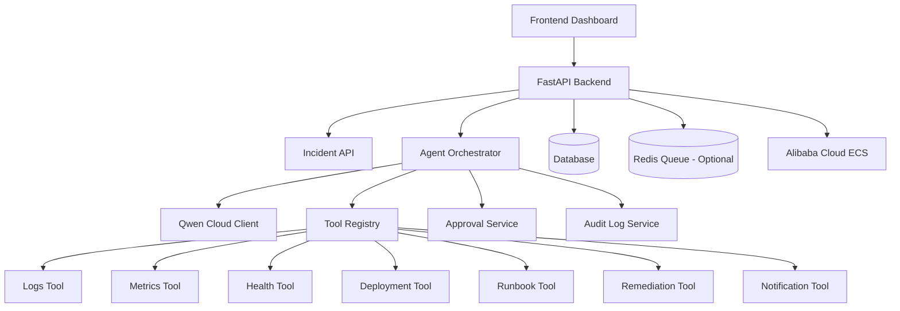

# Architecture

## System Overview

OpsPilot uses a backend-owned orchestration model. FastAPI receives incidents, persists state, calls the agent layer, and exposes thin APIs. The agent asks Qwen Cloud for structured reasoning, but Qwen never executes tools or infrastructure actions directly. Instead, the backend validates tool names, routes execution through a registry, applies risk policy, and records the full audit trail.

## Mermaid Diagram

## Ownership and Safety Boundaries

- FastAPI owns incident state, approval state, and the audit timeline.
- The agent layer owns the controlled workflow loop and `max_steps` enforcement.
- The tool registry owns the allowlist and rejects unknown tools before execution.
- The policy layer decides whether a recommended action is safe, medium, or dangerous.
- Qwen Cloud provides structured reasoning only. It does not call tools, mutate state, or trigger infrastructure by itself.

## Core Components

### Qwen Cloud

Qwen Cloud is the reasoning engine for triage, diagnosis, remediation recommendation, and final reporting. All outputs must be strict JSON and validated before use.

### Backend Services

Business logic stays in services so API handlers remain thin. As the project grows, incidents, approvals, audit logs, and Qwen client logic will each live behind service abstractions.

### Tool Registry

All tool calls pass through a registry that exposes only approved tools. Unknown names are rejected and audited as invalid requests.

### Human Approval

Risky remediation cannot execute immediately. The backend converts those proposals into approval requests with reason, expected impact, and rollback guidance.

### Audit Logging

Every important event is persisted: incident creation, model decisions, tool calls, approval decisions, and remediation results.

## Deployment Target

The demo target is Alibaba Cloud ECS. Local development uses Docker Compose, while the production path later adds a production compose file, reverse proxy, and deployment proof.
