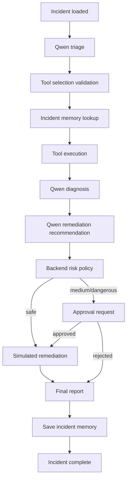

# Agent Design

## What the Agent Does

OpsPilot runs a controlled incident workflow:

1. classify the alert
2. validate tool selection
3. gather evidence
4. retrieve similar incident memory
5. produce a diagnosis
6. recommend remediation
7. apply backend risk policy
8. execute safe actions or create approval requests
9. generate a final report

## What Qwen Is Responsible For

Qwen or the mock provider is responsible for producing structured reasoning for:

- alert classification
- tool plan
- diagnosis
- remediation recommendation
- final incident report

Qwen is not responsible for:

- executing tools
- deciding whether a tool is allowed
- deciding whether an action is safe to run
- bypassing approval

## What the Backend Is Responsible For

- route handling
- persistence
- tool allowlisting
- tool execution
- model output validation
- risk policy
- approval creation and approval decisions
- remediation simulation
- audit logging
- timeline persistence
- fallback behavior when provider output fails

## Agent Loop

## Max Step Limit

The orchestrator enforces a hard `max_steps` limit. This prevents runaway workflows or accidental recursion. The current default is higher than the initial MVP because the workflow now records explicit tool selection, policy, approval, remediation, report, and memory steps.

## Prompt Contracts

Prompt contracts exist for:

- triage
- diagnosis
- remediation
- final report

The tool-selection step is currently derived from validated triage output and then normalized into its own schema.

## Structured JSON Output Requirements

- all model-facing backend calls expect strict JSON
- outputs are validated with Pydantic
- unknown tools are rejected
- malformed or missing fields do not get executed blindly

## Tool Selection

- the model recommends tools
- the backend validates them against the allowlist
- the validated selection is stored as an explicit `AgentStep`
- only then are tools executed

## Tool Result Summarization

Each tool returns a structured `ToolResult` containing:

- `status`
- `data`
- `summary`
- optional `error`

The agent stores the result and uses the summaries as diagnosis context.

## Diagnosis Generation

Diagnosis is generated from:

- incident context
- tool evidence summaries
- similar incident memory, if found

## Remediation Recommendation

Remediation is generated as strict JSON, then checked against backend policy. Dangerous actions do not execute directly.

## Final Report Generation

The agent generates a final report for:

- direct safe-path completion
- approval-completion path
- safe degraded fallback path

## Failure Handling

Implemented failure handling includes:

- unknown tool rejection
- max-step stop
- structured tool failure capture
- approval rejection blocking execution
- safe fallback if Qwen times out
- safe fallback if Qwen returns invalid JSON

## Why the Agent Is Controlled, Not Fully Autonomous

OpsPilot is intentionally backend-controlled so that:

- model output is treated as untrusted input
- infrastructure actions cannot be executed freely
- risky actions require human approval
- every important step remains auditable
