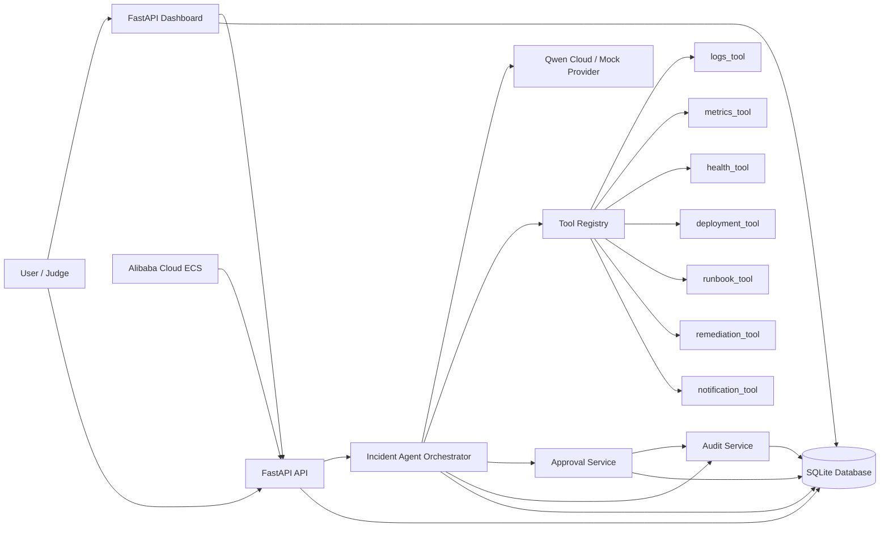
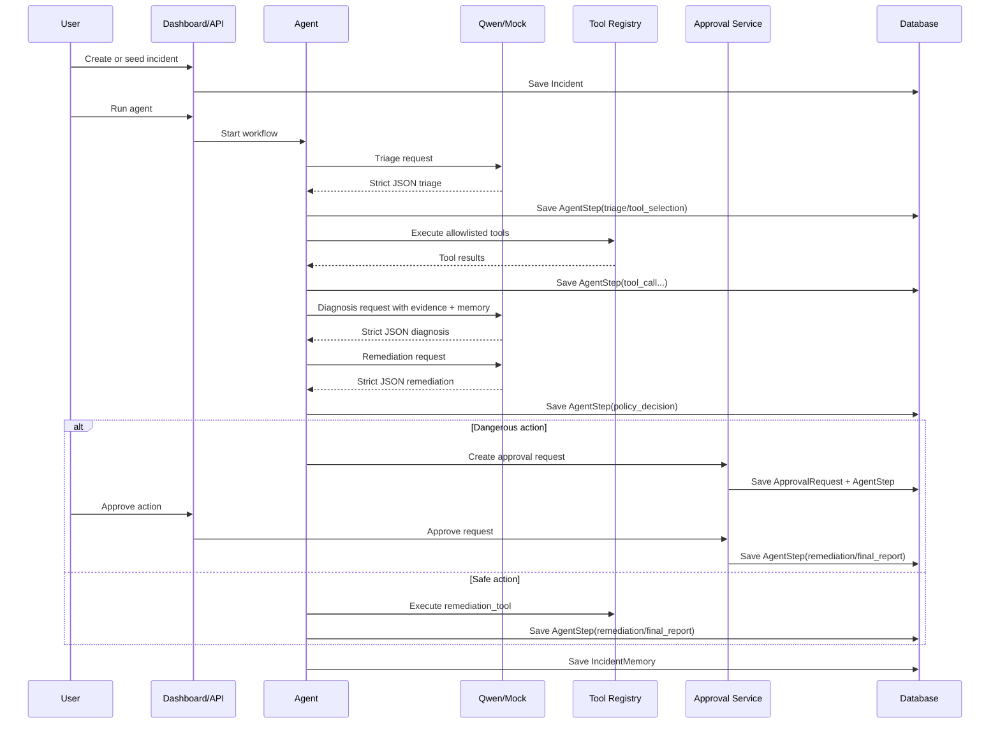
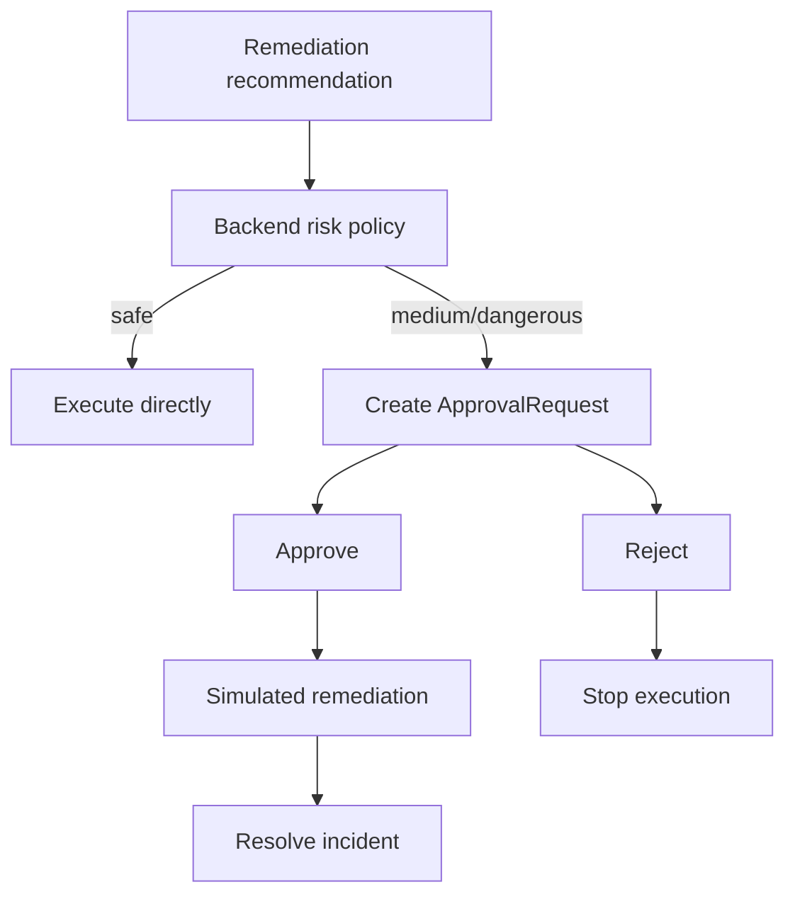
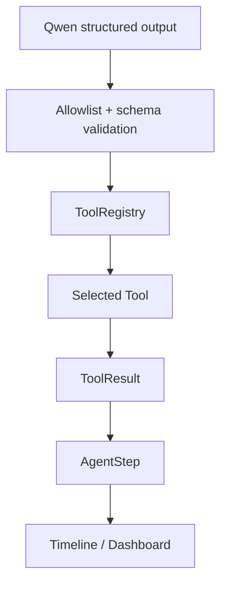

# Comprehensive Architecture

## System Overview

OpsPilot is a backend-controlled incident-response agent designed for SRE-style workflows. It accepts incidents, uses Qwen Cloud or a mock provider for reasoning, gathers evidence through allowlisted tools, applies a backend risk policy, pauses for approval when needed, simulates remediation, records a timeline, and produces evaluation results.

## Main Components

- Frontend/dashboard: FastAPI-served Jinja pages for incidents, approvals, demo scenarios, and evaluation runs
- FastAPI backend: main application runtime, routing, OpenAPI docs, static files
- Incident API: create, list, fetch, update, run agent, read timeline
- Agent orchestrator: controlled workflow loop with max-step limit and safe fallbacks
- Qwen provider/client: `QwenProvider`, `QwenClient`, and `MockProvider`
- Tool registry: allowlisted tool loading and execution
- Incident service: incident persistence and state updates
- Approval service: approval request lifecycle and simulated post-approval execution
- Remediation service: implemented through the remediation tool and approval workflow
- Audit log service: append-only audit records for important actions
- Database: SQLite-backed SQLAlchemy models
- Mock/real tools: logs, metrics, health, deployment, runbook, remediation, notification
- Alibaba Cloud ECS deployment: documented target shape with Docker and Nginx artifacts

## System Architecture Diagram

## Incident Workflow Diagram

## Approval Workflow Diagram

## Tool Invocation Diagram

## Why the Model Does Not Execute Infrastructure Actions Directly

- model output is untrusted
- tool names are validated against the backend allowlist
- remediation actions run only through backend-owned services/tools
- risky actions create `ApprovalRequest` records first
- the dashboard and API expose approval explicitly before simulated execution

## How Backend Validation Works

- Qwen responses must be strict JSON
- Pydantic schemas validate triage, tool selection, diagnosis, remediation, and final report payloads
- unknown tools are rejected
- provider timeout or invalid JSON triggers a safe fallback path

## How Tool Allowlisting Works

- the registry owns the executable tool set
- only registered tool names can run
- the agent validates tool output before continuing
- there is no arbitrary shell or dynamic code execution surface from model output

## How Human Approval Prevents Unsafe Automation

- backend policy owns risk classification
- dangerous actions always require approval
- rejected approvals never execute
- approved actions still use simulated remediation, not direct infrastructure control
