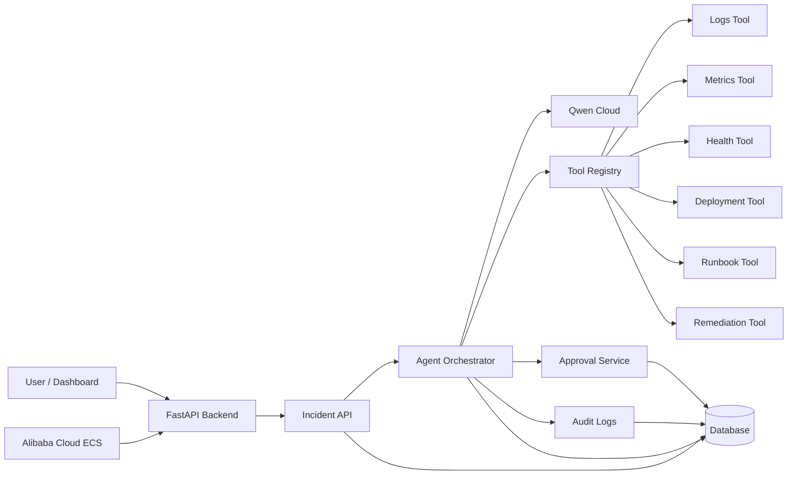

# Architecture Diagram

```mermaid
flowchart LR
    User[User / Dashboard]
    Backend[FastAPI Backend]
    IncidentAPI[Incident API]
    Agent[Agent Orchestrator]
    Qwen[Qwen Cloud]
    Registry[Tool Registry]
    Logs[Logs Tool]
    Metrics[Metrics Tool]
    Health[Health Tool]
    Deploy[Deployment Tool]
    Runbook[Runbook Tool]
    Remediate[Remediation Tool]
    Approval[Approval Service]
    Audit[Audit Logs]
    DB[(Database)]
    ECS[Alibaba Cloud ECS]

    User --> Backend
    Backend --> IncidentAPI
    IncidentAPI --> Agent
    Agent --> Qwen
    Agent --> Registry
    Registry --> Logs
    Registry --> Metrics
    Registry --> Health
    Registry --> Deploy
    Registry --> Runbook
    Registry --> Remediate
    Agent --> Approval
    Agent --> Audit
    IncidentAPI --> DB
    Agent --> DB
    Approval --> DB
    Audit --> DB
    ECS --> Backend
```
