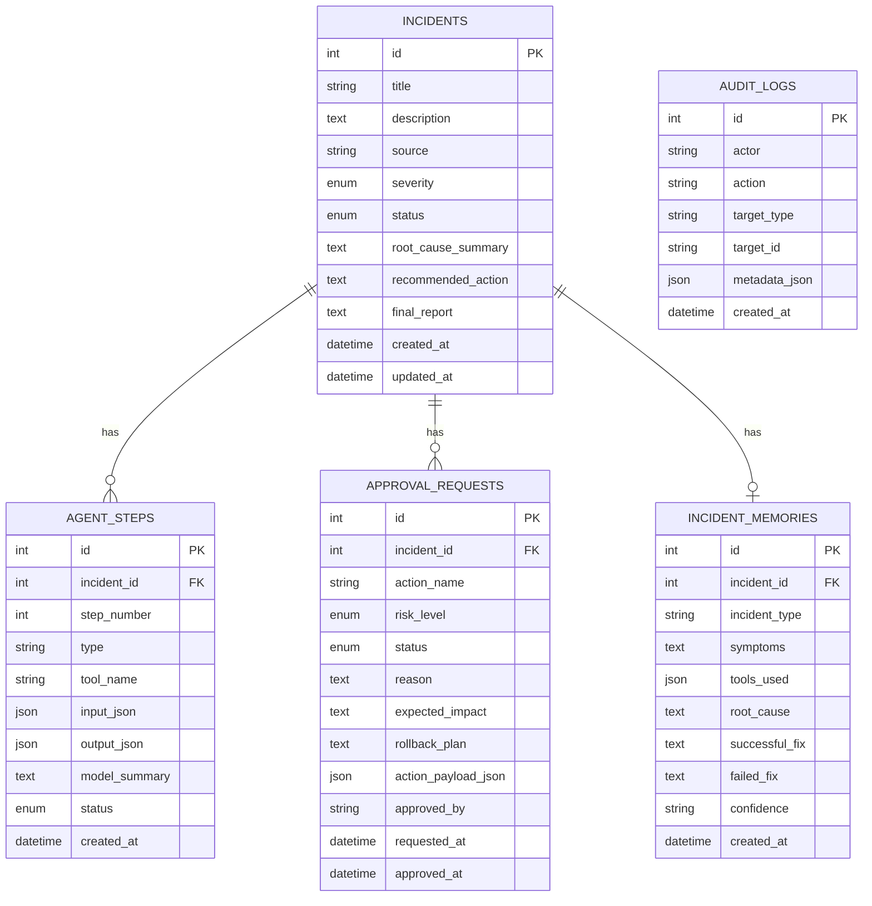

# Database ERD and Design

## Mermaid ERD

## Implemented Models

### `Incident`

Purpose:
- primary incident record
- current lifecycle state
- final human-readable incident summary

Important fields:
- `id`
- `title`
- `description`
- `source`
- `severity`
- `status`
- `root_cause_summary`
- `recommended_action`
- `final_report`
- `created_at`
- `updated_at`

Indexes:
- primary key on `id`

### `AgentStep`

Purpose:
- evidence-first step history for model decisions, tool usage, policy decisions, approval events, remediation, and final reporting

Important fields:
- `incident_id`
- `step_number`
- `type`
- `tool_name`
- `input_json`
- `output_json`
- `model_summary`
- `status`
- `created_at`

Indexes:
- primary key on `id`
- indexed `incident_id`

### `ApprovalRequest`

Purpose:
- pending, approved, or rejected risky remediation records

Important fields:
- `incident_id`
- `action_name`
- `risk_level`
- `status`
- `reason`
- `expected_impact`
- `rollback_plan`
- `action_payload_json`
- `requested_at`
- `approved_by`
- `approved_at`

Indexes:
- primary key on `id`
- indexed `incident_id`

### `AuditLog`

Purpose:
- append-only operational audit records for incident updates, approvals, remediation, and memory save events

Important fields:
- `actor`
- `action`
- `target_type`
- `target_id`
- `metadata_json`
- `created_at`

Indexes:
- primary key on `id`

### `IncidentMemory`

Purpose:
- reusable memory of resolved incidents for future diagnosis context

Important fields:
- `incident_id`
- `incident_type`
- `symptoms`
- `tools_used`
- `root_cause`
- `successful_fix`
- `failed_fix`
- `confidence`
- `created_at`

Indexes:
- primary key on `id`
- unique indexed `incident_id`
- indexed `incident_type`

## Relationships

- `Incident -> AgentStep`: one-to-many
- `Incident -> ApprovalRequest`: one-to-many
- `Incident -> IncidentMemory`: one-to-one
- `AuditLog` is linked by `target_type` + `target_id` rather than foreign keys

## Status Enums

### Incident status

- `new`
- `triaging`
- `waiting_for_approval`
- `remediating`
- `resolved`
- `failed`

### Risk level

- `safe`
- `medium`
- `dangerous`

### Approval status

- `pending`
- `approved`
- `rejected`

### Tool status

- `success`
- `failed`

## Incident State Machine

Typical path:

`new -> triaging -> waiting_for_approval -> resolved`

Safe-path alternative:

`new -> triaging -> resolved`

Failure path:

`new -> triaging -> failed`

## Approval Status Lifecycle

`pending -> approved`

or

`pending -> rejected`

## Auditability Notes

- important incident changes are stored in `AuditLog`
- explicit workflow steps are stored in `AgentStep`
- approval lifecycle exists in both `ApprovalRequest` and timeline-visible records
- memory save events are stored both as audit logs and agent steps
